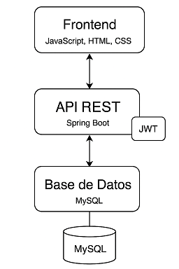
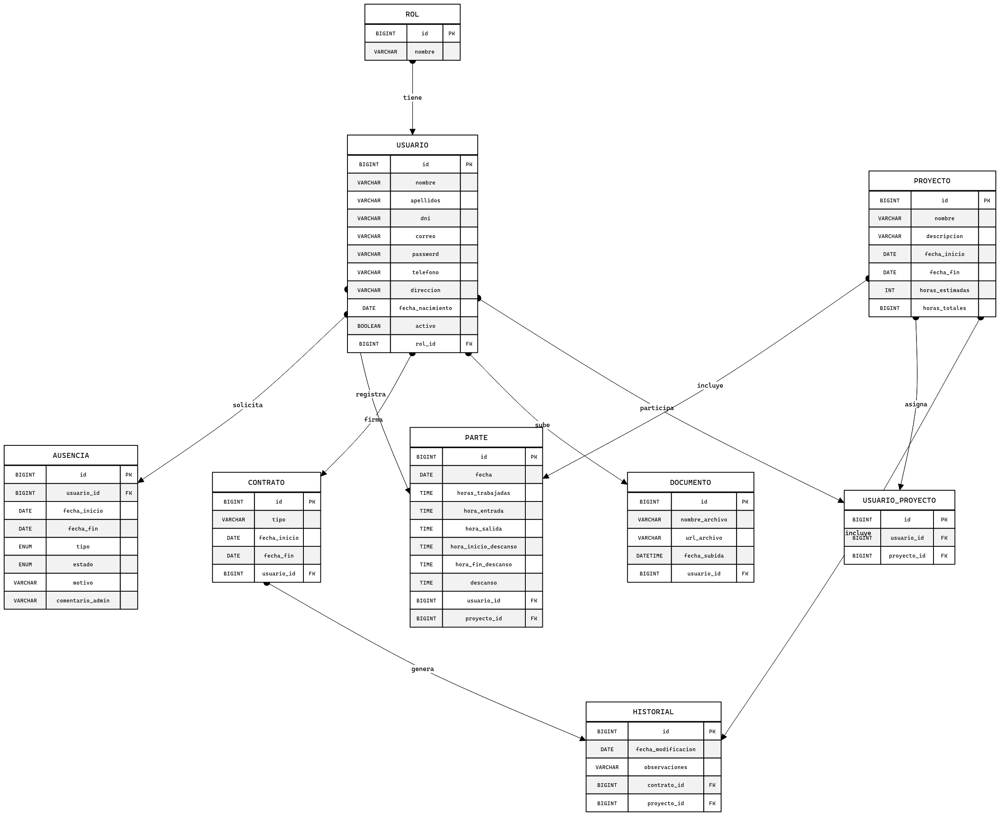
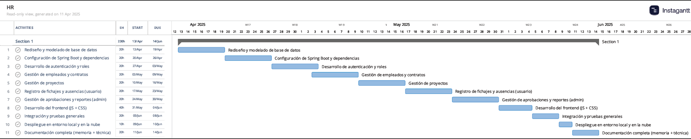
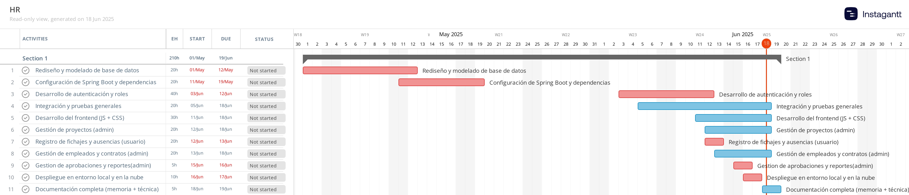
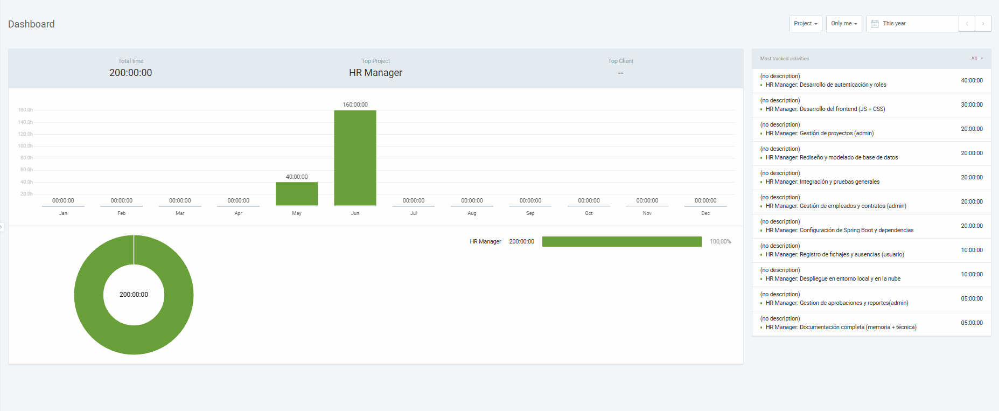

# HR Manager

Aplicación web para la gestión integral de Recursos Humanos orientada a pequeñas y medianas empresas (PYMEs). Desarrollada como proyecto final del ciclo formativo **DAW Dual**, HR Manager permite gestionar empleados, proyectos, ausencias, vacaciones y documentación de forma centralizada y con control de roles.

---

## 1. 📌 Motivación

Durante una experiencia previa desarrollando una app de escritorio en C# y usando herramientas como PlexTime y Redmine, detecté la necesidad de una solución más simple y unificada para la gestión del personal. HR Manager surge como respuesta a esa necesidad real, con el objetivo de evolucionar el concepto hacia una aplicación web moderna.

---

## 2. 🎥 Funcionamiento

La app implementa casi todas las funcionalidades descritas en el anteproyecto:

### 👤 Usuario (Empleado y Admin)
- Iniciar sesión
- Registrar, modificar y consultar sus partes de horas.
- Solicitar vacaciones y ausencias
- Consultar el estado de sus solicitudes de vacaciones y ausencias
- Modificar sus peticiones de vacaciones y ausencias pendientes
- Consultar y modificar sus datos personales
- Cambiar la contraseña

### 🛠 Administrador
- Alta, baja y modificación de trabajadores
- Gestión de contratos y documentos de trabajadores
- Gestión de proyectos: Creación, modificación
- Asignación de empleados a proyectos
- Aprobación o rechazo de ausencias
- Visualización de historiales de Proyectos y Empleados

### 📝 Otros
- Cuando un usuario está inactivo (lo "eliminamos"), no puede acceder a la app.
- Los proyectos no pueden ser eliminados para no perder la información asociada a ellos.
- Cuando el proyecto no tiene empleados asignados, no se pueden crear partes en el proyecto. 
---

## 3. 🎯 Justificación de objetivos

Se han cumplido casi todos los objetivos definidos en el anteproyecto. Las historias de usuario fueron implementadas por completo excepto la exportación de informes/historiales:

| Historia de Usuario                             | Estado |
|-------------------------------------------------|--------|
| Registro y login seguro (JWT)                   | ✅ |
| CRUD empleados y proyectos                      | ✅ |
| Registro y control de horas                     | ✅ |
| Solicitud y aprobación de ausencias             | ✅ |
| Gestión de documentos y contratos               | ✅ |
| Generación de historiales por empleado/proyecto | ✅ |
| Exportación de informes por empleado/proyecto   | ❌ |

---

## 4. 🛠 Descripción Técnica

### a. Arquitectura de la aplicación 📄

- **Frontend**: HTML, CSS y JavaScript
- **Backend**: Java 21 con Spring Boot (REST API, Spring Security, JPA)
- **Base de datos**: MySQL
- **Autenticación**: JWT
- **Despliegue**: Render + Railway (gratuitos)



## 🛠️ Estructura del Proyecto

````
hrmanager/
├── src/
│   ├── main/
│   │   ├── java/com/hrmanager/
│   │   │   ├── HrManagerApplication.java
│   │   │   ├── config             # Configuraciones de seguridad
│   │   │   ├── dto/               # dtos
│   │   │   ├── model/             # entidades
│   │   │   ├── repository/        # Repositorios JPA
│   │   │   ├── service/           # Lógica de negocio
│   │   │   ├── security/          # Seguridad; autenticación y autorización
│   │   │   └── controller/        # Endpoints REST
│   │   └── resources/
│   │       ├── static/
│   │       │   ├── icons/          # Iconos/imagenes
│   │       │   ├── partials/       # Sidebar & Header
│   │       │   ├── html            # Archivos HTML
│   │       │   ├── css/            # Archivos estilo CSS
│   │       │   │   └── styles.css
│   │       │   └── js/
│   │       │       └── js          # Archivos JS
│   │       └── application.properties
├── test/
│   └── java/com/hrmanager/
├── pom.xml
└── README.md
````

### b. Diagrama de Componentes 📄


### c. Diagrama E/R 📄



---

## 5. 🔁 Metodología de desarrollo

Modelo en cascada, con fases consecutivas:

1. Análisis y diseño
2. Configuración del entorno
3. Modelado de datos (MySQL)
4. Backend (API REST con Spring Boot)
5. Frontend (JS + HTML + CSS)
6. Pruebas manuales

**Flujo de trabajo en GitHub**:
- Commits etiquetados por módulo
- Issues cerradas por funcionalidad
- Branch principal (`main`)

---

## 6. Gantt: Planificación vs. Realidad 📄


- Gantt inicial (planificado)



- Gantt final (real)



---

## 7. ⏱ Clockify del desarrollo 📄





> **Análisis:** La mayor carga recayó en la configuración del backend y seguridad, como era previsible.

---

## 8. 💰 Presupuesto técnico (amortizado) 📄

| Fase                    | Software usado       | Licencia   | Coste amortizado |
|-------------------------|----------------------|------------|------------------|
| Desarrollo Backend      | IntelliJ Community   | Gratuita   | 0 €              |
| Modelado BD             | MySQL Workbench      | Gratuita   | 0 €              |
| Desarrollo Frontend     | VS Code              | Gratuita   | 0 €              |
| Pruebas REST            | Postman              | Gratuita   | 0 €              |
| Despliegue en la nube    | Render + Railway     | Gratuita   | 0 €              |

| Fase                    | horas                | €/hona     | Coste            |
|-------------------------|----------------------|------------|------------------|
| Mano obra               |210                   | 15         | 3150 €            |
| **Total Coste Técnico** |                      |            | **3150€**          |

---

## 9. ✅ Conclusiones
HR Manager cumple casi todos los objetivos propuestos, consolidando conocimientos técnicos en seguridad, bases de datos, arquitectura REST y diseño web.
### a. Posibles mejoras
- Frontend más moderno e intuitivo

 Incorporar un framework como React o Vue, para obtener una interfaz más atractiva y dinámica.
 
También se podrían incluir componentes como calendarios para solicitar ausencias o revisar históricos.

Soporte para múltiples idiomas y accesibilidad

- Exportación de historiales a PDF

Implementar en el backend un servicio que genere PDFs (por ejemplo con la librería iText o similar) y ofrecer un botón de descarga en las páginas de historial.

- Mayor cobertura de pruebas

Pruebas unitarias y de integración en src/test/java para cubrir los principales controladores y servicios. Esto ayudaría a prevenir regresiones.

- Optimizacion de las validaciones  

Validaciones en partes de ausencias y vacaciones con respecto a las fechas duplicadas

Validaciones en partes de horas con respecto a fechas inicio y fin de proyectos y contratos

Validaciones en cambios y creación de contraseñas

Validaciones de formatos y longitudes en los formularios

- Sistema de notificaciones por correo


- Subir archivos desde el equipo


### b. Dificultades encontradas
- Configuración de seguridad JWT
- Organización modular del código en Spring Boot
- Poco tiempo

### c. Falta por implementar
- Exportación de informes/historiales en PDF


## Visitame en : 
- https://hr-manager-du56.onrender.com/index.html
- https://hrmanager.up.railway.app/index.html
