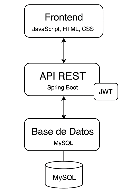
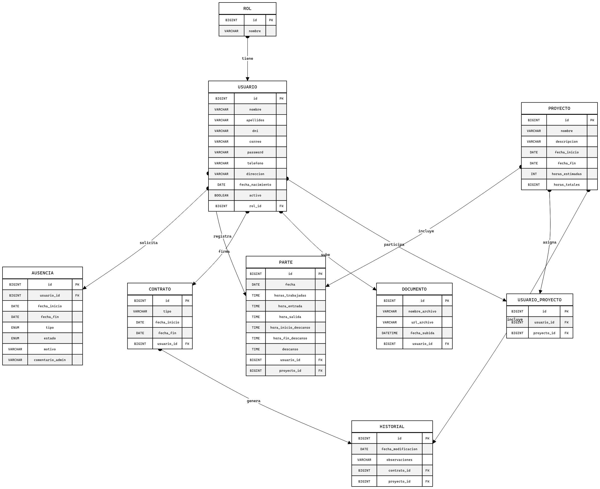
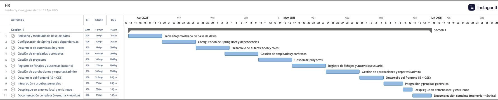
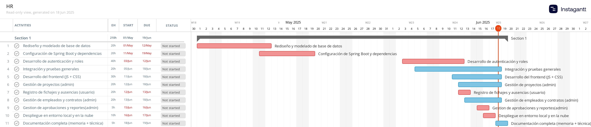
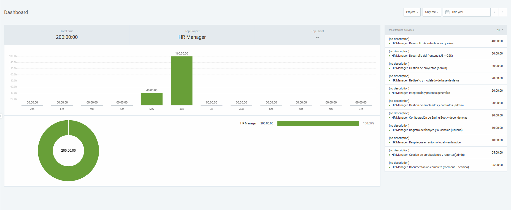
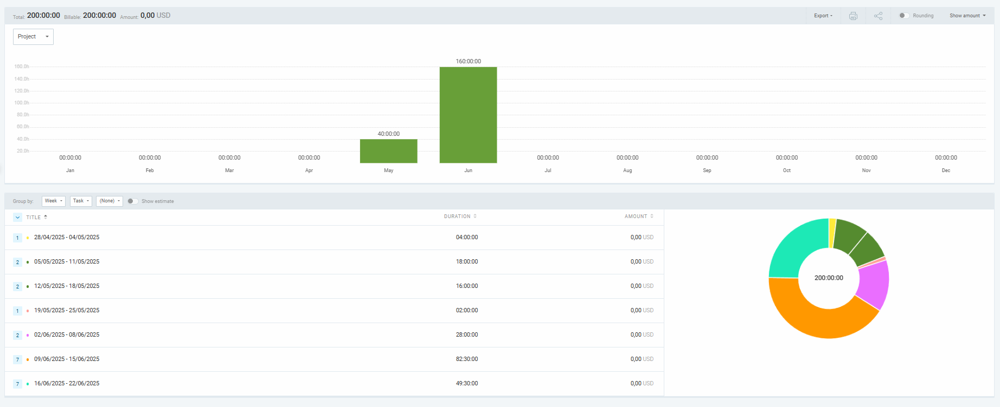

# **HR Manager**

**HR Manager** nace como evolución de una aplicación de escritorio previa en C# y responde a una necesidad real observada en el entorno empresarial de Plexus: la fragmentación y complejidad de herramientas como PlexTime y Redmine. Esta solución web se enfoca en unificar la gestión de personal, control horario, vacaciones y proyectos, pensada específicamente para PYMEs y empresas de pequeño tamaño. Adicionalmente, se implementa autenticación segura con roles diferenciados (Administrador/Usuario).

---

**Tabla de contenido**

- [**Introducción**](#introducción)
- [**Historia**](#historia)
- [**Objetivos**](#objetivos)
- [**Manual del Usuario**](#manual-del-usuario)
- [**Metodología**](#metodología)
- [**Descripción Técnica**](#descripción-técnica)
    - [**Arquitectura**](#arquitectura)
    - [**Tecnologías Utilizadas**](#tecnologías-utilizadas)
    - [**Diagrama de Componentes**](#diagrama-de-componentes)
    - [**Modelo E/R**](#modelo-er)
- [**Planificación y Tiempo**](#planificación-y-tiempo)
    - [**Gantt**](#gantt)
    - [**Clockify**](#clockify)
- [**Presupuesto Técnico**](#presupuesto-técnico)
- [**Conclusiones**](#conclusiones)
    - [**Posibles Mejoras**](#posibles-mejoras)

---

# **Introducción**

El uso de múltiples plataformas para gestionar fichajes, ausencias y documentación genera fricciones en el entorno empresarial. HR Manager pretende centralizar estas funciones en una sola herramienta web, intuitiva y accesible, optimizando la gestión de RRHH para pequeñas y medianas empresas.

---

# **Historia**

El proyecto surge en prácticas con una versión en C# que no llegó a completarse, pero sirvió de base para construir una solución profesional. Esta evolución no solo representa una mejora técnica sino también el crecimiento personal como desarrolladora full-stack.

---

# **Objetivos**

- Centralizar la gestión de empleados, proyectos, ausencias y partes horarios.
- Implementar una API REST con Spring Boot y JWT.
- Crear una interfaz simple con JavaScript y CSS sin frameworks complejos.
- Soportar roles diferenciados y autenticación segura.
- Exportación de informes e historiales.

---

# **Manual del Usuario**

### 👤 Usuario (Empleado)
- Iniciar sesión
- Registrar horas y descansos
- Solicitar vacaciones/ausencias
- Ver el estado de solicitudes

### 🛠 Administrador
- Alta/baja/modificación de empleados
- Asignar empleados a proyectos
- Creación de proyectos
- Aprobar/rechazar ausencias
- Gestión de documentos y contratos
- Generación de informes por proyecto/trabajador

---

# **Metodología**

Se ha seguido un modelo en cascada con fases cerradas y validación al final de cada bloque. El flujo de trabajo se organiza en GitHub con commits descriptivos por módulo y pruebas manuales al finalizar cada bloque funcional.

---

# **Descripción Técnica**

## Arquitectura

Aplicación basada en tres capas:

- **Frontend:** HTML, CSS, JavaScript (sin frameworks)
- **Backend:** Java 21, Spring Boot, Spring Security, JPA
- **Base de Datos:** MySQL (Railway)
- **Seguridad:** JWT
- **Despliegue:** Render (app) + Railway (BD)

## Tecnologías Utilizadas

| Backend         | Frontend       | Base de Datos | Seguridad | Testing/API |
|----------------|----------------|---------------|-----------|-------------|
| Java 21        | HTML/CSS/JS    | MySQL         | JWT       | Postman     |
| Spring Boot    | JS puro        | Railway       | SpringSec |             |

## Diagrama de Componentes

## Modelo E/R

---

# **Planificación y Tiempo**

## Gantt
Gantt (planificado)

Gant (real)

## Clockify

- Backend: 45%
- Frontend: 35%
- Pruebas: 15%
- Documentación: 5%

> Las tareas más intensivas fueron la configuración de roles y seguridad JWT.

---

# **Presupuesto Técnico**

| Fase                  | Software         | Licencia   | Coste |
|-----------------------|------------------|------------|-------|
| Backend               | IntelliJ         | Gratuita   | 0 €   |
| Frontend              | VS Code          | Gratuita   | 0 €   |
| Base de Datos         | MySQL Workbench  | Gratuita   | 0 €   |
| API Testing           | Postman          | Gratuita   | 0 €   |
| Despliegue            | Render/Railway   | Gratuita   | 0 €   |
| Documentación         | Google Drive     | Gratuita   | 0 €   |
| **Total**             |                  |            | **0 €** |

---

# **Conclusiones**

HR Manager cumple casi todos los objetivos propuestos, consolidando conocimientos técnicos en seguridad, bases de datos, arquitectura REST y diseño web.

## Posibles Mejoras

- Exportación en PDF
- Panel de estadísticas y métricas
- Notificaciones por correo
- Multiidioma y adaptación visual
- Pruebas automatizadas

---